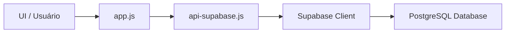

# 📦 Loggi Stock - Sistema de Gestão de Estoque

> Sistema web completo para controle de estoque com analytics em tempo real, inventário físico, controle de EPIs e integração com Supabase.

<div align="center">


[🚀 Demo](https://vanderleynascimento.github.io/GAS-ESTOQUE/login.html) • [📖 Docs](#-índice) • [🐛 Issues](https://github.com/VanderleyNascimento/GAS-ESTOQUE/issues)

</div>

---

## 📋 Índice

- [Visão Geral](#-visão-geral)
- [Preview](#-preview)
- [Quick Start](#-quick-start)
- [Deploy (Vercel)](#-deploy-vercel)
- [Funcionalidades](#-funcionalidades)
- [Tecnologias](#-tecnologias)
- [Instalação Local](#-instalação-local)
- [Arquitetura](#-arquitetura)
- [Segurança](#-segurança)
- [Contribuindo](#-contribuindo)
- [Licença](#-licença)

---

## 🎯 Visão Geral

O **Loggi Stock** é um sistema de gestão de estoque desenvolvido para otimizar o controle de materiais e EPIs (Equipamentos de Proteção Individual). Recentemente migrado para **Supabase**, oferece performance superior, segurança robusta e escalabilidade.

### ✨ Destaques

- 📊 **Dashboard em tempo real** com KPIs e gráficos interativos
- 📋 **Sistema de inventário** com contagem física e reconciliação
- 🔍 **Busca inteligente** com autocomplete por ID e nome
- 📱 **Scanner QR Code** para identificação rápida de itens
- 👥 **Controle de acesso** com autenticação segura (SHA-256)
- 📈 **Analytics** com gráficos de comparação e timeline
- 🔒 **Segurança** - Credenciais protegidas via variáveis de ambiente
- ⚡ **Performance** - Cache inteligente, lazy loading, debounce

---

## 📸 Preview

> **Nota:** Screenshots serão adicionados em breve. Acesse a [demo ao vivo](https://vanderleynascimento.github.io/GAS-ESTOQUE/login.html) para ver o sistema em ação!

---

## 🚀 Quick Start

Comece em **5 minutos**:

```bash
# 1. Clone o repositório
git clone https://github.com/VanderleyNascimento/GAS-ESTOQUE.git
cd GAS-ESTOQUE

# 2. Configure as credenciais
cp js/supabase-config.example.js js/supabase-config.js
# Edite js/supabase-config.js com suas chaves do Supabase

# 3. Execute localmente
npx serve
```

---

## 🚀 Deploy (Vercel)

A maneira mais fácil e segura de colocar o Loggi Stock no ar é usando a **Vercel**. O projeto já está configurado para injetar as credenciais de forma segura durante o build.

### Passo a Passo

1.  Faça um **Fork** deste repositório para o seu GitHub.
2.  Crie uma conta na [Vercel](https://vercel.com) e faça login com o GitHub.
3.  Clique em **"Add New..."** → **"Project"** e selecione o repositório `GAS-ESTOQUE`.
4.  Na tela de configuração ("Configure Project"), vá até a seção **Environment Variables** e adicione:

    | Nome da Variável | Valor | Descrição |
    | :--- | :--- | :--- |
    | `SUPABASE_URL` | `https://seu-projeto.supabase.co` | URL do seu projeto Supabase |
    | `SUPABASE_ANON_KEY` | `sua-chave-anon-publica` | Chave pública (anon) do Supabase |

5.  Clique em **Deploy**.

> **Como funciona:** O script de build (`build-config.js`) lerá essas variáveis e criará o arquivo de configuração automaticamente, mantendo suas chaves fora do repositório público.

---

## ✨ Funcionalidades

### 🏠 Dashboard
- **KPIs Interativos:** Total de itens, Críticos, Giro, Cobertura.
- **Gráficos em Tempo Real:** Status do estoque e últimas movimentações.

### 📊 Analytics
- **Comparação de Estoque:** Atual vs. Crítico.
- **Timeline:** Evolução temporal das movimentações.

### 📦 Materiais
- **Gestão Completa:** CRUD, busca por ID/nome, filtros.
- **Ações:** Movimentação, QR Code, Exclusão segura.

### 📋 Inventário
- **Contagem Física:** Scanner QR integrado, resumo em tempo real.
- **Reconciliação:** Ajuste automático de divergências.

### 🔐 Autenticação
- **Segurança:** Hash SHA-256, Sessão persistente.
- **Gestão:** Login seguro e bloqueio de inativos.

---

## 🛠️ Tecnologias

- **Frontend:** HTML5, CSS3 (Tailwind), JavaScript (ES6+).
- **Backend:** Supabase (PostgreSQL, Auth, Realtime).
- **Libs:** Chart.js, html5-qrcode, CryptoJS.

---

## 📥 Instalação Local

Se preferir rodar em sua própria máquina:

1.  **Clone o repositório:**
    ```bash
    git clone https://github.com/VanderleyNascimento/GAS-ESTOQUE.git
    ```

2.  **Configure o Banco de Dados:**
    - Crie um projeto no [Supabase](https://supabase.com).
    - Execute o script `tools/supabase-schema.sql` no SQL Editor do Supabase.

3.  **Configure as Credenciais:**
    - Copie `js/supabase-config.example.js` para `js/supabase-config.js`.
    - Insira suas credenciais no arquivo.

    > [!IMPORTANT]
    > O arquivo `js/supabase-config.js` está no `.gitignore` para sua segurança. **Nunca commite este arquivo com chaves reais.**

4.  **Execute:**
    ```bash
    npx serve
    # ou
    python -m http.server 8000
    ```

---

## 🏗️ Arquitetura

### Estrutura de Diretórios

```
GAS-ESTOQUE/
├── index.html              # SPA Principal
├── js/
│   ├── app.js              # Core Logic
│   ├── api-supabase.js     # API Client
│   ├── auth.js             # Auth Module
│   └── ...
├── tools/
│   └── supabase-schema.sql # Database Schema
└── vercel.json             # Vercel Config
```

### Fluxo de Dados



---

## 🔒 Segurança

- **Proteção de Credenciais:** Utilizamos variáveis de ambiente (Vercel) ou arquivos ignorados pelo Git (Local) para proteger chaves de API.
- **Hash de Senha:** SHA-256 no client-side.
- **RLS (Row Level Security):** Recomendamos ativar RLS no Supabase para restringir acesso aos dados.

---

## 🤝 Contribuindo

Contribuições são bem-vindas!

1.  Fork o projeto.
2.  Crie uma branch (`git checkout -b feature/NovaFeature`).
3.  Commit (`git commit -m 'feat: Nova funcionalidade'`).
4.  Push (`git push origin feature/NovaFeature`).
5.  Abra um Pull Request.

> [!CAUTION]
> **Nunca inclua credenciais reais em seus commits.** Use sempre os arquivos de exemplo (`.example.js`) para demonstrar mudanças na configuração.

---

## 📄 Licença

Este projeto está sob a licença **MIT**. Veja o arquivo [LICENSE](LICENSE) para detalhes.

---

<div align="center">

**Feito com ❤️ por Vanderley Nascimento**

[⬆ Voltar ao topo](#-loggi-stock---sistema-de-gestão-de-estoque)

</div>
