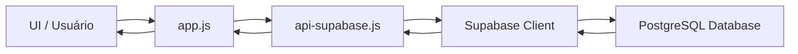
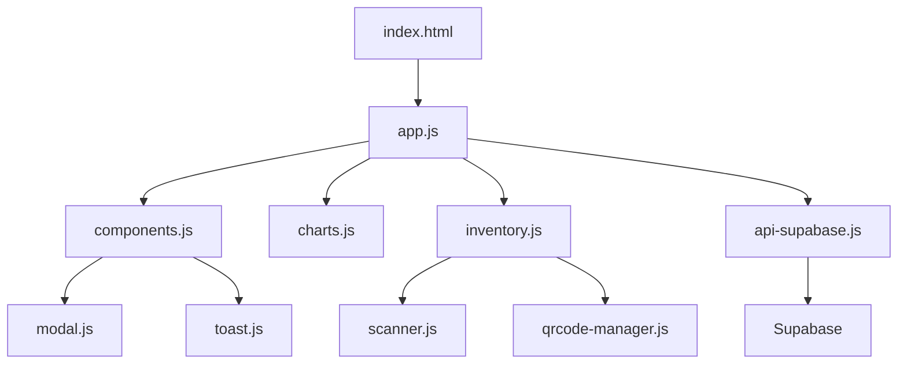

# 📦 Loggi Stock - Sistema de Gestão de Estoque

> Sistema web completo para controle de estoque com analytics em tempo real, inventário físico, controle de EPIs e integração com Supabase.

<div align="center">


[🚀 Demo](https://vanderleynascimento.github.io/GAS-ESTOQUE/login.html) • [📖 Docs](#-índice) • [🐛 Issues](https://github.com/VanderleyNascimento/GAS-ESTOQUE/issues)

</div>

---

## 📋 Índice

- [Visão Geral](#-visão-geral)
- [Preview](#-preview)
- [Quick Start](#-quick-start)
- [Funcionalidades](#-funcionalidades)
- [Tecnologias](#-tecnologias)
- [Instalação Completa](#-instalação-completa)
- [Uso](#-uso)
- [Arquitetura](#-arquitetura)
- [Segurança](#-segurança)
- [Performance](#-performance)
- [Contribuindo](#-contribuindo)
- [Licença](#-licença)

---

## 🎯 Visão Geral

O **Loggi Stock** é um sistema de gestão de estoque desenvolvido para otimizar o controle de materiais e EPIs (Equipamentos de Proteção Individual). Recentemente migrado para **Supabase**, oferece performance superior, segurança robusta e escalabilidade.

### ✨ Destaques

- 📊 **Dashboard em tempo real** com KPIs e gráficos interativos
- 📋 **Sistema de inventário** com contagem física e reconciliação
- 🔍 **Busca inteligente** com autocomplete por ID e nome
- 📱 **Scanner QR Code** para identificação rápida de itens
- 👥 **Controle de acesso** com autenticação segura (SHA-256)
- 📈 **Analytics** com gráficos de comparação e timeline
- 🔒 **Segurança** - Credenciais protegidas, templates de configuração
- ⚡ **Performance** - Cache inteligente, lazy loading, debounce

---

## 📸 Preview

> **Nota:** Screenshots serão adicionados em breve. Acesse a [demo ao vivo](https://vanderleynascimento.github.io/GAS-ESTOQUE/login.html) para ver o sistema em ação!

### Interface Principal

- **Dashboard** - KPIs, gráficos e resumo executivo
- **Materiais** - Tabela completa com busca e filtros
- **Analytics** - Comparações e timeline de movimentações
- **Inventário** - Contagem física com scanner QR

---

## 🚀 Quick Start

Comece em **5 minutos**:

```bash
# 1. Clone o repositório
git clone https://github.com/VanderleyNascimento/GAS-ESTOQUE.git
cd GAS-ESTOQUE

# 2. Configure o Supabase
# - Crie um projeto em https://supabase.com
# - Execute tools/supabase-schema.sql no SQL Editor

# 3. Configure as credenciais
cp js/supabase-config.example.js js/supabase-config.js
# Edite js/supabase-config.js com suas credenciais

# 4. Execute localmente
npx serve
# ou
python -m http.server 8000

# 5. Acesse http://localhost:8000
```

> [!TIP]
> Veja a [Instalação Completa](#-instalação-completa) para instruções detalhadas.

---

## ✨ Funcionalidades

### 🏠 Dashboard

- **KPIs Interativos:**
  - Total de itens cadastrados
  - Itens críticos (abaixo do estoque mínimo)
  - Índice de giro (turnover rate)
  - Cobertura em dias
  
- **Gráficos em Tempo Real:**
  - Itens críticos (déficit prioritário)
  - Status do estoque (OK, Atenção, Crítico)
  - Últimas movimentações (Live feed)

### 📊 Analytics

- **Comparação de Estoque:**
  - Estoque atual vs. estoque crítico
  - Layout scrollável para muitos itens
  - Responsivo mobile
  
- **Timeline de Movimentações:**
  - Evolução temporal por item
  - Toggle individual de items
  - Seleção/desseleção em massa

### 📦 Materiais

- **Gestão Completa:**
  - CRUD (Criar, Ler, Atualizar, Deletar)
  - Busca por ID ou nome
  - Filtros por status e tipo
  - Badges visuais de status
  - Indicador de EPIs
  
- **Ações:**
  - Movimentação (entrada/saída)
  - Geração de QR Code
  - Exclusão segura (com modal de confirmação)

### 📋 Inventário

- **Contagem Física:**
  - Busca com autocomplete
  - Scanner QR Code integrado
  - Resumo em tempo real (Contados, Sobras, Faltas)
  - Histórico de inventários
  
- **Reconciliação:**
  - Identificação automática de divergências
  - Ajuste de estoque com um clique

### 🔐 Autenticação

- **Segurança:**
  - Hash SHA-256 de senhas
  - Sessão persistente
  - Controle de permissões (Admin/Operador)
  
- **Gestão de Usuários:**
  - Login seguro
  - Bloqueio de usuários inativos

---

## 🛠️ Tecnologias

### Frontend

- **HTML5** - Estrutura semântica
- **CSS3** + **Tailwind CSS** - Estilização moderna e responsiva
- **JavaScript (ES6+)** - Lógica do aplicativo (Modular)
- **Font Awesome 6** - Ícones SVG
- **Chart.js 4** - Gráficos interativos

### Backend/Database

- **Supabase** (PostgreSQL)
  - Banco de dados relacional robusto
  - API REST automática via PostgREST
  - Segurança Row Level Security (RLS)
  
### Bibliotecas

- **html5-qrcode** - Scanner QR Code
- **qrcode.js** - Geração de QR Codes
- **CryptoJS** - Hashing SHA-256
- **Supabase JS Client** - Integração com backend

---

## 📥 Instalação Completa

### Pré-requisitos

- Navegador moderno (Chrome, Firefox, Edge)
- Conta no [Supabase](https://supabase.com/)
- Servidor web local ou hospedagem

### Passo a Passo

1. **Clone o repositório:**

```bash
git clone https://github.com/VanderleyNascimento/GAS-ESTOQUE.git
cd GAS-ESTOQUE
```

2. **Configure o Supabase:**

   - Crie um novo projeto no Supabase.
   - Execute o script SQL fornecido em `tools/supabase-schema.sql` no Editor SQL do Supabase para criar as tabelas (`estoque`, `movimentacoes`, `usuarios`, `inventarios`).

3. **Configure as Credenciais:**

> [!CAUTION]
> **NUNCA commite credenciais reais!** Os arquivos `js/config.js` e `js/supabase-config.js` estão protegidos pelo `.gitignore`. Use sempre os templates `.example.js` como referência.

#### 3.1. Configurar Supabase

Copie o template e adicione suas credenciais:

```bash
cp js/supabase-config.example.js js/supabase-config.js
```

Edite `js/supabase-config.js`:

```javascript
const SUPABASE_URL = 'https://SEU_PROJECT_ID.supabase.co';
const SUPABASE_ANON_KEY = 'SUA_ANON_KEY_AQUI';
```

📍 **Onde encontrar:**
- Acesse seu projeto no [Supabase Dashboard](https://app.supabase.com/)
- Vá em **Settings** → **API**
- Copie **Project URL** e **anon/public key**

#### 3.2. Configurar SheetDB (Opcional - Legacy)

Se ainda estiver usando SheetDB, copie o template:

```bash
cp js/config.example.js js/config.js
```

Edite `js/config.js`:

```javascript
const CONFIG = {
    ESTOQUE_API: 'https://sheetdb.io/api/v1/SEU_ID_ESTOQUE',
    USERS_API: 'https://sheetdb.io/api/v1/SEU_ID_USUARIOS?sheet=usuarios',
    // ...
};
```

> [!WARNING]
> **Credenciais Comprometidas?**
> 
> Se você acidentalmente commitou credenciais:
> 1. **Rotacione imediatamente** as chaves no Supabase/SheetDB
> 2. Limpe o histórico do Git com `git filter-branch` ou BFG Repo-Cleaner
> 3. Force push para sobrescrever o histórico remoto (⚠️ cuidado em projetos colaborativos)

4. **Execute localmente:**

```bash
# Com Python 3
python -m http.server 8000

# Com Node.js
npx serve
```

Acesse: `http://localhost:8000`

---

## 💡 Uso

### Primeiro Acesso

1. Acesse a URL do sistema.
2. Faça login (usuário padrão criado via SQL ou cadastro novo).
   - **Nota:** Novos cadastros precisam ser ativados no banco de dados (`ativo = 1`).
3. Cadastre materiais pelo botão "+" (FAB).

### Movimentações

1. Clique no botão de ação de um material ou use o Scanner.
2. Selecione tipo (Entrada/Saída).
3. Informe quantidade.
4. Confirme a operação.

### Inventário

1. Acesse a aba "Inventário".
2. Use o campo de busca ou scanner QR para contar itens.
3. O sistema calcula automaticamente sobras e faltas.
4. Finalize o balanço para atualizar o estoque oficial.

---

## 🏗️ Arquitetura

### Estrutura de Diretórios

```
GAS-ESTOQUE/
├── index.html              # Página principal (SPA)
├── login.html              # Página de autenticação
├── criar-usuario.html      # Cadastro de usuários
├── css/
│   └── styles.css          # Estilos customizados
├── js/
│   ├── app.js              # Orquestrador principal
│   ├── api-supabase.js     # Camada de API Supabase
│   ├── auth-supabase.js    # Autenticação Supabase
│   ├── auth.js             # Autenticação SheetDB (legacy)
│   ├── components.js       # Componentes UI (Tabelas, Modais)
│   ├── charts.js           # Visualização de Dados
│   ├── inventory.js        # Gestão de Inventário
│   ├── scanner.js          # Scanner QR Code
│   ├── qrcode-manager.js   # Geração de QR Codes
│   ├── toast.js            # Notificações
│   ├── modal.js            # Sistema de modais
│   ├── confirm-modal.js    # Modais de confirmação
│   ├── config.example.js   # Template de configuração SheetDB
│   └── supabase-config.example.js  # Template Supabase
├── tools/
│   └── supabase-schema.sql # Schema do banco de dados
└── README.md               # Documentação
```

### Fluxo de Dados



### Componentes Principais



---

## 🔒 Segurança

### Práticas Implementadas

- 🔐 **SHA-256** - Hash de senhas client-side antes do envio
- 🛡️ **Supabase RLS** - Row Level Security pode ser configurado
- 👥 **Validação de Contas** - Usuários novos nascem desativados
- 🔑 **Configuração Protegida** - Credenciais em arquivos ignorados pelo Git
- 📝 **Templates de Exemplo** - `.example.js` files para referência segura
- ⚠️ **Alertas de Segurança** - Documentação clara sobre proteção de credenciais

### Configuração Segura

> [!IMPORTANT]
> **Arquivos Protegidos pelo .gitignore:**
> - `js/config.js` - Configuração SheetDB
> - `js/supabase-config.js` - Configuração Supabase
>
> **Nunca commite estes arquivos!** Use os templates `.example.js` como referência.

### Rotação de Credenciais

Se suas credenciais foram expostas:

1. **Rotacione imediatamente** no Supabase Dashboard
2. Atualize o arquivo local `js/supabase-config.js`
3. **Não commite** o arquivo atualizado
4. Considere limpar o histórico do Git com BFG Repo-Cleaner

---

## 🚀 Performance

### Otimizações Implementadas

- ✅ **Migração para SQL** - Consultas complexas otimizadas no banco
- ✅ **Cache Inteligente** - 5 minutos de TTL para reduzir requisições
- ✅ **Lazy Loading** - Carregamento de módulos sob demanda
- ✅ **Debounce** - Otimização de busca e input (300ms)
- ✅ **Z-Index Fix** - Correções de sobreposição de UI
- ✅ **Modularização** - Código organizado em módulos independentes

### Métricas

- **Tempo de carregamento inicial:** < 2s
- **Tempo de resposta API:** < 500ms (média)
- **Cache hit rate:** ~80% após uso inicial

---

## 🤝 Contribuindo

Contribuições são bem-vindas! Siga estas diretrizes:

### Como Contribuir

1. **Fork** o projeto
2. **Crie** uma branch (`git checkout -b feature/MinhaFeature`)
3. **Commit** suas mudanças (`git commit -m 'feat: Minha funcionalidade'`)
4. **Push** para a branch (`git push origin feature/MinhaFeature`)
5. Abra um **Pull Request**

### Diretrizes de Segurança

> [!CAUTION]
> **Ao contribuir, NUNCA inclua:**
> - Credenciais reais (API keys, tokens, senhas)
> - Arquivos `js/config.js` ou `js/supabase-config.js`
> - Dados sensíveis de produção
>
> Use sempre os templates `.example.js` para demonstrar configurações.

### Padrões de Commit

Seguimos [Conventional Commits](https://www.conventionalcommits.org/):

- `feat:` - Nova funcionalidade
- `fix:` - Correção de bug
- `docs:` - Documentação
- `style:` - Formatação
- `refactor:` - Refatoração
- `test:` - Testes
- `chore:` - Manutenção

---

## 📄 Licença

Este projeto está sob a licença **MIT**. Veja o arquivo [LICENSE](LICENSE) para detalhes.

---

## 👥 Autores

- **Vanderley Nascimento** - [@VanderleyNascimento](https://github.com/VanderleyNascimento)

---

## 🙏 Agradecimentos

- [Supabase](https://supabase.com/) - Backend as a Service
- [Tailwind CSS](https://tailwindcss.com/) - Framework CSS
- [Chart.js](https://www.chartjs.org/) - Biblioteca de gráficos
- [Font Awesome](https://fontawesome.com/) - Ícones

---

## 📞 Suporte

- 📧 Email: [Criar Issue](https://github.com/VanderleyNascimento/GAS-ESTOQUE/issues)
- 💬 Discussões: [GitHub Discussions](https://github.com/VanderleyNascimento/GAS-ESTOQUE/discussions)
- 🐛 Bugs: [Report Issue](https://github.com/VanderleyNascimento/GAS-ESTOQUE/issues/new)

---

<div align="center">

**Feito com ❤️ por Vanderley Nascimento**

⭐ Se este projeto te ajudou, considere dar uma estrela!

[⬆ Voltar ao topo](#-loggi-stock---sistema-de-gestão-de-estoque)

</div>
