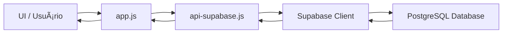

# 📦 Loggi Stock - Sistema de Gestão de Estoque

> Sistema web completo para controle de estoque com analytics em tempo real, inventário físico, controle de EPIs e integração com Supabase.

<div align="center">


[🚀 Demo](https://vanderleynascimento.github.io/Loggi-Stock/) • [📖 Docs](#documentação) • [🐛 Issues](https://github.com/VanderleyNascimento/GAS-ESTOQUE/issues)

</div>

---

## 📋 Índice

- [Visão Geral](#-visão-geral)
- [Funcionalidades](#-funcionalidades)
- [Tecnologias](#-tecnologias)
- [Instalação](#-instalação)
- [Uso](#-uso)
- [Arquitetura](#-arquitetura)
- [API](#-api)
- [Contribuindo](#-contribuindo)
- [Licença](#-licença)

---

## 🎯 Visão Geral

O **Loggi Stock** é um sistema de gestão de estoque desenvolvido para otimizar o controle de materiais e EPIs (Equipamentos de Proteção Individual). Recentemente migrado para **Supabase**, oferece performance superior, segurança robusta e escalabilidade.

- 📊 **Dashboard em tempo real** com KPIs e gráficos interativos
- 📋 **Sistema de inventário** com contagem física e reconciliação
- 🔍 **Busca inteligente** com autocomplete por ID e nome
- 📱 **Scanner QR Code** para identificação rápida de itens
- 👥 **Controle de acesso** com autenticação segura (SHA-256)
- 📈 **Analytics** com gráficos de comparação e timeline

---

## ✨ Funcionalidades

### 🏠 Dashboard

- **KPIs Interativos:**
  - Total de itens cadastrados
  - Itens críticos (abaixo do estoque mínimo)
  - Índice de giro (turnover rate)
  - Cobertura em dias
  
- **Gráficos em Tempo Real:**
  - Itens críticos (déficit prioritário)
  - Status do estoque (OK, Atenção, Crítico)
  - Últimas movimentações (Live feed)

### 📊 Analytics

- **Comparação de Estoque:**
  - Estoque atual vs. estoque crítico
  - Layout scrollável para muitos itens
  - Responsivo mobile
  
- **Timeline de Movimentações:**
  - Evolução temporal por item
  - Toggle individual de items
  - Seleção/desseleção em massa

### 📦 Materiais

- **Gestão Completa:**
  - CRUD (Criar, Ler, Atualizar, Deletar)
  - Busca por ID ou nome
  - Filtros por status e tipo
  - Badges visuais de status
  - Indicador de EPIs
  
- **Ações:**
  - Movimentação (entrada/saída)
  - Geração de QR Code
  - Exclusão segura (com modal de confirmação)

### 📋 Inventário

- **Contagem Física:**
  - Busca com autocomplete
  - Scanner QR Code integrado
  - Resumo em tempo real (Contados, Sobras, Faltas)
  - Histórico de inventários
  
- **Reconciliação:**
  - Identificação automática de divergências
  - Ajuste de estoque com um clique

### 🔐 Autenticação

- **Segurança:**
  - Hash SHA-256 de senhas
  - Sessão persistente
  - Controle de permissões (Admin/Operador)
  
- **Gestão de Usuários:**
  - Login seguro
  - Bloqueio de usuários inativos

---

## 🛠️ Tecnologias

### Frontend

- **HTML5** - Estrutura semântica
- **CSS3** + **Tailwind CSS** - Estilização moderna e responsiva
- **JavaScript (ES6+)** - Lógica do aplicativo (Modular)
- **Font Awesome 6** - Ícones SVG
- **Chart.js 4** - Gráficos interativos

### Backend/Database

- **Supabase** (PostgreSQL)
  - Banco de dados relacional robusto
  - API REST automática via PostgREST
  - Segurança Row Level Security (RLS)
  
### Bibliotecas

- **html5-qrcode** - Scanner QR Code
- **qrcode.js** - Geração de QR Codes
- **CryptoJS** - Hashing SHA-256
- **Supabase JS Client** - Integração com backend

---

## 📥 Instalação

### Pré-requisitos

- Navegador moderno (Chrome, Firefox, Edge)
- Conta no [Supabase](https://supabase.com/)
- Servidor web local ou hospedagem

### Passo a Passo

1. **Clone o repositório:**

```bash
git clone https://github.com/VanderleyNascimento/GAS-ESTOQUE.git
cd GAS-ESTOQUE
```

2. **Configure o Supabase:**

   - Crie um novo projeto no Supabase.
   - Execute o script SQL fornecido em `tools/supabase-schema.sql` no Editor SQL do Supabase para criar as tabelas (`estoque`, `movimentacoes`, `usuarios`, `inventarios`).

3. **Configure as Credenciais:**

> [!CAUTION]
> **NUNCA commite credenciais reais!** Os arquivos `js/config.js` e `js/supabase-config.js` estão protegidos pelo `.gitignore`. Use sempre os templates `.example.js` como referência.

#### 3.1. Configurar Supabase

Copie o template e adicione suas credenciais:

```bash
cp js/supabase-config.example.js js/supabase-config.js
```

Edite `js/supabase-config.js`:

```javascript
const SUPABASE_URL = 'https://SEU_PROJECT_ID.supabase.co';
const SUPABASE_ANON_KEY = 'SUA_ANON_KEY_AQUI';
```

📍 **Onde encontrar:**
- Acesse seu projeto no [Supabase Dashboard](https://app.supabase.com/)
- Vá em **Settings** → **API**
- Copie **Project URL** e **anon/public key**

#### 3.2. Configurar SheetDB (Opcional - Legacy)

Se ainda estiver usando SheetDB, copie o template:

```bash
cp js/config.example.js js/config.js
```

Edite `js/config.js`:

```javascript
const CONFIG = {
    ESTOQUE_API: 'https://sheetdb.io/api/v1/SEU_ID_ESTOQUE',
    USERS_API: 'https://sheetdb.io/api/v1/SEU_ID_USUARIOS?sheet=usuarios',
    // ...
};
```

> [!WARNING]
> **Credenciais Comprometidas?**
> 
> Se você acidentalmente commitou credenciais:
> 1. **Rotacione imediatamente** as chaves no Supabase/SheetDB
> 2. Limpe o histórico do Git com `git filter-branch` ou BFG Repo-Cleaner
> 3. Force push para sobrescrever o histórico remoto (⚠️ cuidado em projetos colaborativos)

4. **Execute localmente:**

```bash
# Com Python 3
python -m http.server 8000

# Com Node.js
npx serve
```

Acesse: `http://localhost:8000`

---

## 💡 Uso

### Primeiro Acesso

1. Acesse a URL do sistema.
2. Faça login (usuário padrão criado via SQL ou cadastro novo).
   - **Nota:** Novos cadastros precisam ser ativados no banco de dados (`ativo = 1`).
3. Cadastre materiais pelo botão "+" (FAB).

### Movimentações

1. Clique no botão de ação de um material ou use o Scanner.
2. Selecione tipo (Entrada/Saída).
3. Informe quantidade.
4. Confirme a operação.

### Inventário

1. Acesse a aba "Inventário".
2. Use o campo de busca ou scanner QR para contar itens.
3. O sistema calcula automaticamente sobras e faltas.
4. Finalize o balanço para atualizar o estoque oficial.

---

## 🏗️ Arquitetura

### Estrutura de Diretórios

```
GAS-ESTOQUE/
├── index.html              # Página principal (SPA)
├── css/
│   └── styles.css          # Estilos customizados
├── js/
│   ├── app.js              # Orquestrador principal
│   ├── api-supabase.js     # Camada de API Supabase
│   ├── auth.js             # Lógica de Autenticação
│   ├── components.js       # Componentes UI (Tabelas, Modais)
│   ├── charts.js           # Visualização de Dados
│   ├── inventory.js        # Gestão de Inventário
│   ├── scanner.js          # Scanner QR Code
│   ├── toast.js            # Notificações
│   └── confirm-modal.js    # Modais de Confirmação
└── README.md               # Documentação
```

### Fluxo de Dados



---

## 🚀 Performance

### Otimizações

- ✅ **Migração para SQL** - Consultas complexas otimizadas no banco.
- ✅ **Lazy Loading** - Carregamento de módulos sob demanda.
- ✅ **Debounce** - Otimização de busca e input.
- ✅ **Z-Index Fix** - Correções de sobreposição de UI.

---

## 🔒 Segurança

- 🔐 **SHA-256** para hash de senhas (client-side antes do envio).
- 🛡️ **Supabase RLS** (Row Level Security) pode ser configurado para maior proteção.
- 👥 **Validação de Contas** - Usuários novos nascem desativados.

---

## 🤝 Contribuindo

Contribuições são bem-vindas!

1. **Fork** o projeto
2. **Crie** uma branch (`git checkout -b feature/MinhaFeature`)
3. **Commit** suas mudanças (`git commit -m 'feat: Minha funcionalidade'`)
4. **Push** para a branch (`git push origin feature/MinhaFeature`)
5. Abra um **Pull Request**

---

## 📄 Licença

Este projeto está sob a licença **MIT**. Veja o arquivo [LICENSE](LICENSE) para detalhes.

---

## 👥 Autores

- **Vanderley Nascimento** - [@VanderleyNascimento](https://github.com/VanderleyNascimento)

---

<div align="center">

**Feito com ❤️ por Vanderley Nascimento**

⭐ Se este projeto te ajudou, considere dar uma estrela!

</div>
